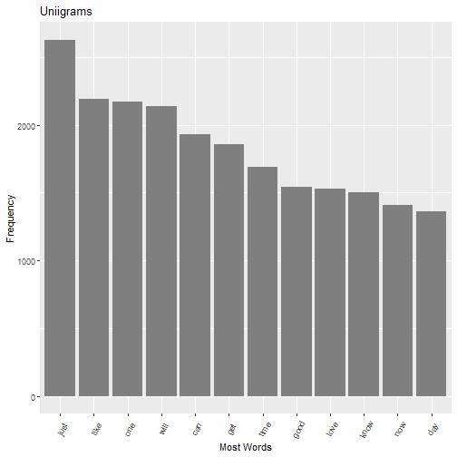
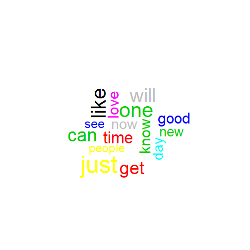
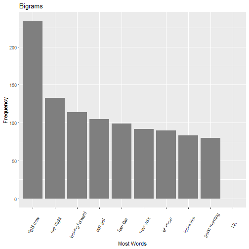
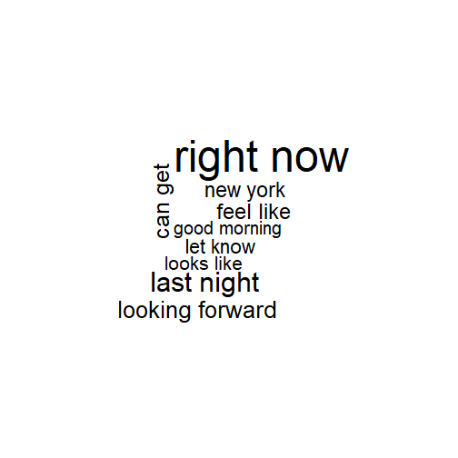
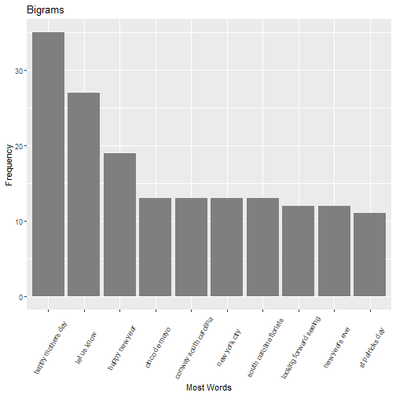
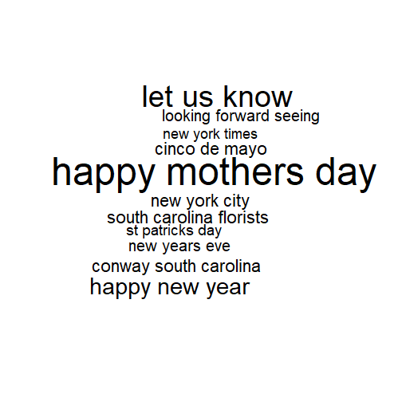

# Johns Hopkins Milestone Report for Capstone  


## Loading Data  

```r
blogs_path <- 'H:/Coursera/Johns_Hopkins_Data_Course/JH_Capstone/en_US/en_US.blogs.txt'
news_path <- 'H:/Coursera/Johns_Hopkins_Data_Course/JH_Capstone/en_US/en_US.news.txt'
twitter_path <- 'H:/Coursera/Johns_Hopkins_Data_Course/JH_Capstone/en_US/en_US.twitter.txt'

blogs <- readLines(blogs_path, n = -1, encoding = 'UTF-8')
news <- readLines(news_path, n = -1, encoding = 'UTF-8')
```

```
## Warning in readLines(news_path, n = -1, encoding = "UTF-8"): incomplete final line found on 'H:/Coursera/Johns_Hopkins_Data_Course/JH_Capstone/en_US/
## en_US.news.txt'
```

```r
twitter <- readLines(twitter_path, n = -1, encoding = 'UTF-8')
```

```
## Warning in readLines(twitter_path, n = -1, encoding = "UTF-8"): line 167155 appears to contain an embedded nul
```

```
## Warning in readLines(twitter_path, n = -1, encoding = "UTF-8"): line 268547 appears to contain an embedded nul
```

```
## Warning in readLines(twitter_path, n = -1, encoding = "UTF-8"): line 1274086 appears to contain an embedded nul
```

```
## Warning in readLines(twitter_path, n = -1, encoding = "UTF-8"): line 1759032 appears to contain an embedded nul
```
## Split into words then characters  
Words first  

```r
twitterwords <- wordcount(twitter, sep = ' ', count.function = sum)
blogswords <- wordcount(blogs, sep = ' ', count.function = sum)
newswords <- wordcount(news, sep = ' ', count.function = sum)
```

Then characters  

```r
nchar_twitter<-sum(nchar(twitter))
nchar_blogs<-sum(nchar(blogs))
nchar_news<-sum(nchar(news))
```

## Create data frame of values  

```r
text_df <- data.frame("File Name" = c("twitter", "blogs", "news"),
                      "num.lines" = c(length(twitter),length(blogs), length(news)),
                      "num.words" = c(sum(blogswords), sum(newswords), sum(twitterwords)),
                      "Num of character"=c(nchar_blogs,nchar_news,nchar_twitter))

text_df
```

```
##   File.Name num.lines num.words Num.of.character
## 1   twitter   2360148  37334131        206824505
## 2     blogs    899288   2643969         15639408
## 3      news     77259  30373543        162096031
```

## Create Corpora  

```r
blogs <- (VectorSource(blogs))
news <- (VectorSource(news))
twitter <- (VectorSource(twitter))

blogs <- Corpus(blogs)
news <- Corpus(news)
twitter <- Corpus(twitter)
```

## Create sample of all corpora  

```r
sampledata<-c(sample(twitter,length(twitter)*0.01),
              sample(blogs,length(blogs)*0.01),
              sample(news,length(news)*0.01))
```

## Turn sample into a corpus and normalize it  

This gets rid of punctuation, whitespace, stop words i.e. "a", "it", "the", etc., numbers, and changes all letters to lowercase. This makes future text analytics a smoother process.  


```r
corpus <- VCorpus(VectorSource(sampledata))
```

```r
toSpace <- content_transformer(function(x, pattern) gsub(pattern, " ", x))
corpus <- tm_map(corpus, toSpace, "(f|ht)tp(s?)://(.*)[.][a-z]+")
corpus <- tm_map(corpus, toSpace, "@[^\\s]+")
corpus <- tm_map(corpus, tolower)
corpus <- tm_map(corpus, removeWords, stopwords("en"))
corpus <- tm_map(corpus, removePunctuation)
corpus <- tm_map(corpus, removeNumbers)
corpus <- tm_map(corpus, stripWhitespace)
corpus <- tm_map(corpus, PlainTextDocument)
```

## Create data frame from the cleaned sample  


```r
corpusresult<-data.frame(text=unlist(sapply(corpus,'[',"content")),stringsAsFactors = FALSE)

head(corpusresult)
```

```
##                                                                                                      text
## 1                                                                            nope shows organized ocd lol
## 2                                                                                           know fun way 
## 3                                                                                            boys can smd
## 4 filtering new scratch acoustic tracks written last months will hone lyrics arrangements present ustream
## 5                                              long national nightmare jessica simpson finally gave birth
## 6          limited edition please pork hammer hurt em tee sold starting design limited edition gonna rule
```


## Unigrams  


```r
unigram <- function(x) NGramTokenizer(x, Weka_control(min = 1, max = 1))
tdm_unigram = TermDocumentMatrix(corpus, control = list(tokenize = unigram))

unigramcorpus<-findFreqTerms(tdm_unigram,lowfreq=80)
unicorpus_sums <- rowSums(as.matrix(tdm_unigram[unigramcorpus,]))
tdm_unigram <- data.frame(Word = names(unicorpus_sums), frequency = unicorpus_sums)
unicorpus_sort <- tdm_unigram[order(-tdm_unigram$frequency),]
```

## Graph top unigrams  


```r
ggplot(unicorpus_sort[1:12,],aes(x=reorder(Word,-frequency),y=frequency))+
        geom_bar(stat="identity",fill = I("grey50"))+
        labs(title="Uniigrams",x="Most Words",y="Frequency")+
        theme(axis.text.x=element_text(angle=60, vjust = .5))
```




## Wordcloud representation of top results  


```r
wordcloud(tdm_unigram$Word, tdm_unigram$frequency, max.words = 15, random.order = T, colors = tdm_unigram$frequency)
```



## Bigrams  


```r
Bigram <- function(x) NGramTokenizer(x, Weka_control(min = 2, max = 2))
tdm_bigram = TermDocumentMatrix(corpus, control = list(tokenize = Bigram))

bigramcorpus<-findFreqTerms(tdm_bigram,lowfreq=80)
bicorpus_sums <- rowSums(as.matrix(tdm_bigram[bigramcorpus,]))
tdm_bigram <- data.frame(Word = names(bicorpus_sums), frequency = bicorpus_sums)
bicorpus_sort <- tdm_bigram[order(-tdm_bigram$frequency),]
```

## Graph top bigrams  


```r
ggplot(bicorpus_sort[1:12,],aes(x=reorder(Word,-frequency),y=frequency))+
        geom_bar(stat="identity",fill = I("grey50"))+
        labs(title="Bigrams",x="Most Words",y="Frequency")+
        theme(axis.text.x=element_text(angle=60, vjust = .5))
```

```
## Warning: Removed 3 rows containing missing values (position_stack).
```



## Wordcloud representation of top results  


```r
wordcloud(tdm_bigram$Word, tdm_bigram$frequency, max.words = 15, random.order = T)
```



## Trigrams  


```r
trigram <- function(x) NGramTokenizer(x, Weka_control(min = 3, max = 3))
tdm_trigram = TermDocumentMatrix(corpus, control = list(tokenize = trigram))

trigramcorpus<-findFreqTerms(tdm_trigram,lowfreq=10)
tricorpus_sums <- rowSums(as.matrix(tdm_trigram[trigramcorpus,]))
tdm_trigram <- data.frame(Word = names(tricorpus_sums), frequency = tricorpus_sums)
tricorpus_sort <- tdm_trigram[order(-tdm_trigram$frequency),]
```

## Graph top trigrams  


```r
ggplot(tricorpus_sort[1:10,],aes(x=reorder(Word,-frequency),y=frequency))+
        geom_bar(stat="identity",fill = I("grey50"))+
        labs(title="Bigrams",x="Most Words",y="Frequency")+
        theme(axis.text.x=element_text(angle=60, vjust = .5))
```



## Wordcloud representation of top results  


```r
wordcloud(tdm_trigram$Word, tdm_trigram$frequency, max.words = 15, random.order = T)
```




